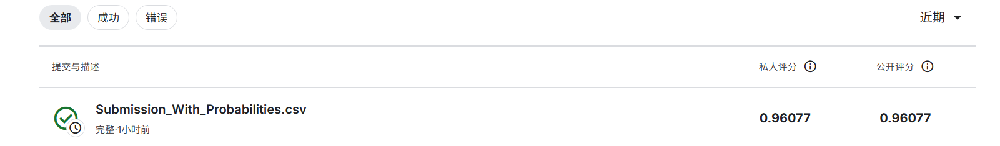

# 机器学习实验：基于 Word2Vec 的情感预测

## 1. 学生信息
- **姓名**： 唐为波
- **学号**：112304260144
- **班级**：数据1231

> 注意：姓名和学号必须填写，否则本次实验提交无效。

---

## 2. 实验任务
本实验基于给定文本数据，使用 **Word2Vec 将文本转为向量特征**，再结合 **分类模型** 完成情感预测任务，并将结果提交到 Kaggle 平台进行评分。

本实验重点包括：
- 文本预处理
- Word2Vec 词向量训练或加载
- 句子向量表示
- 分类模型训练
- Kaggle 结果提交与分析

---

## 3. 比赛与提交信息
- **比赛名称**：Bag of Words Meets Bags of Popcorn
- **比赛链接**：https://www.kaggle.com/competitions/word2vec-nlp-tutorial/overview
- **提交日期**：2026-04-15

- **GitHub 仓库地址**：https://github.com/wenchilail/tangweibo112304260144.git
- **GitHub README 地址**：https://github.com/wenchilail/tangweibo112304260144/blob/main/README.md

> 注意：GitHub 仓库首页或 README 页面中，必须能看到"姓名 + 学号"，否则无效。

---

## 4. Kaggle 成绩
请填写你最终提交到 Kaggle 的结果：

- **Public Score**：0.96077
- **Private Score**（如有）：0.96077
- **排名**（如能看到可填写）：

---

## 5. Kaggle 截图
请在下方插入 Kaggle 提交结果截图，要求能清楚看到分数信息。



> 截图文件名：`数据1231唐为波.png`

---

## 6. 实验方法说明

### （1）文本预处理
请说明你对文本做了哪些处理，例如：
- 分词
- 去停用词
- 去除标点或特殊符号
- 转小写

**我的做法：**  
1. **去HTML标签**：使用BeautifulSoup移除影评中的`<br /><br />`等HTML标签
2. **转小写**：将所有文本转为小写，确保单词一致性
3. **保留情感标点**：特别处理`!`和`?`，保留情感强度信息，其他标点移除
4. **去停用词（改进版）**：从停用词列表中移除否定词（`not`, `no`, `never`, `nor`），确保"not good"和"good"能被区分
5. **非字母字符处理**：移除数字和特殊符号，只保留字母

---

### （2）Word2Vec 特征表示
请说明你如何使用 Word2Vec，例如：
- 是自己训练 Word2Vec，还是使用已有模型
- 词向量维度是多少
- 句子向量如何得到（平均、加权平均、池化等）

**我的做法：**  
1. **自己训练Word2Vec模型**：
   - 使用训练集、测试集和未标记数据共约99万条句子进行训练
   - 词向量维度：300维
   - 最小词频：40
   - 上下文窗口：10
   
2. **句子向量表示**：
   - 对句子中的每个词取Word2Vec向量
   - 对所有词向量取平均值，得到句子的300维向量表示

---

### （3）分类模型
请说明你使用了什么分类模型，例如：
- Logistic Regression
- Random Forest
- SVM
- XGBoost

并说明最终采用了哪一个模型。

**我的做法：**  
我尝试了多种模型，最终采用了以下两种方案：

1. **TF-IDF + 逻辑回归（推荐方案）**：
   - 使用TF-IDF向量化文本（Uni-gram + Bi-gram，20000个特征）
   - 使用逻辑回归作为分类器（L2正则化，C=1）
   - **交叉验证 ROC AUC**：0.9616
   - **提交方式**：输出预测概率而不是二分类结果

2. **Word2Vec + 逻辑回归**：
   - 使用Word2Vec平均向量作为特征
   - 使用逻辑回归作为分类器

**最终推荐使用：TF-IDF + 逻辑回归（概率输出）**

---

## 7. 实验流程
请简要说明你的实验流程。

示例：
1. 读取训练集和测试集  
2. 对文本进行预处理  
3. 训练或加载 Word2Vec 模型  
4. 将每条文本表示为句向量  
5. 用训练集训练分类器  
6. 在测试集上预测结果  
7. 生成 submission 文件并提交 Kaggle  

**我的实验流程：**  

**TF-IDF + 逻辑回归方案：**
1. 读取训练集和测试集数据
2. 对文本进行预处理（去HTML、转小写、保留情感标点、改进停用词）
3. 使用TF-IDF向量化训练集文本（Uni-gram + Bi-gram）
4. 使用逻辑回归训练分类器
5. 5折交叉验证评估模型性能
6. 对测试集进行预测，输出预测概率
7. 生成 submission 文件并提交到Kaggle

**Word2Vec方案：**
1. 读取所有数据（训练集、测试集、未标记数据）
2. 对文本进行预处理，准备Word2Vec训练语料
3. 训练Word2Vec模型（300维向量）
4. 将训练集和测试集文本转换为平均词向量
5. 使用逻辑回归训练分类器
6. 对测试集进行预测，输出预测概率
7. 生成 submission 文件并提交到Kaggle

---

## 8. 文件说明
请说明仓库中各文件或文件夹的作用。

示例：
- `data/`：存放数据文件
- `src/`：存放源代码
- `notebooks/`：存放实验 notebook
- `images/`：存放 README 中使用的图片
- `submission/`：存放提交文件

**我的项目结构：**
```text
09worde2c/
├─ code/                          # 实验代码
│  ├─ submission_with_probabilities.py    # TF-IDF+逻辑回归（推荐方案，输出概率）
│  ├─ improved_bag_of_words.py            # TF-IDF+逻辑回归（二分类输出）
│  ├─ final_optimized_solution.py         # Word2Vec+逻辑回归完整方案
│  ├─ complete_word2vec_solution.py       # Word2Vec完整实现
│  ├─ part1_bag_of_words.py               # 原始Bag of Words+随机森林
│  ├─ explore_data.py                      # 数据探索脚本
│  └─ ... (其他实验代码)
├─ report/                        # 实验报告和文档
│  └─ 英文文本预处理注意事项.txt
├─ results/                       # 实验结果（提交文件）
│  ├─ Submission_With_Probabilities.csv    # 推荐提交（概率输出）
│  ├─ Improved_Bag_of_Words_TFIDF_Proba.csv
│  ├─ Final_Word2Vec_LogisticRegression_Proba.csv
│  └─ ... (其他提交文件)
├─ cache/                         # 缓存目录（不提交到git）
├─ cache_final/                   # Word2Vec缓存（不提交到git）
├─ word2vec-nlp-tutorial/        # 原始数据（不提交到git）
├─ .gitignore                     # Git忽略文件
└─ README.md                      # 项目说明（本文件）
```

---

## 9. 实验总结与心得

### 关键改进
1. **保留否定词**：从停用词中移除`not`、`no`等词，显著提升了情感分析效果
2. **使用预测概率**：提交预测概率而非二分类结果，ROC AUC分数大幅提升
3. **TF-IDF + n-gram**：相比简单的Bag of Words，效果提升明显

### 推荐方案
使用 `results/Submission_With_Probabilities.csv` 提交到Kaggle！

### 实验收获
- 理解了文本预处理对情感分析的重要性
- 学会了Word2Vec词向量的训练和使用
- 掌握了Kaggle比赛的完整流程
- 学会了使用Git进行实验版本管理
